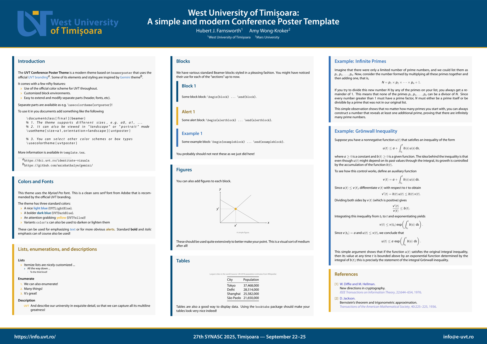

# UVT Conference Poster Template

[](https://github.com/alexfikl/uvt-poster/actions/workflows/ci.yml)
[](https://www.overleaf.com/docs?snip_uri=https://github.com/alexfikl/uvt-poster/archive/refs/heads/main.zip)

> [!NOTE]
> This template style is fairly complete and working well, but any feature requests
> or bug reports to improve it are **very welcome**! The theme should adjust to
> various aspect ratios and page sizes.

This is an unofficial conference poster template for UVT (West University of Timișoara).
It is loosely based on the official UVT [branding](https://dci.uvt.ro/identitate-vizuala).
However, the university does not offer an example of a conference poster, so this is
just inspired by the existing examples.

Templates in the same series:
* [UVT Letterhead Template](https://github.com/alexfikl/uvt-letterhead)
* [UVT Beamer Presentation Template](https://github.com/alexfikl/uvt-beamer)
* [UVT Conference Poster Template](https://github.com/alexfikl/uvt-poster)

## What it Looks Like

[Full PDF](template.pdf)


## How to Use It

Copy `beamerthemeuvtposter.sty`, `beamercolorthemeuvtposter.sty`, `template.tex`,
and the relevant logos from `assets/` to your working directory. Modify
`template.tex` as appropriate and build with `PDFLaTeX` (or `XeLaTeX` or `LuaLaTeX`
for the adventurous). The poster is based on the [beamerposter](https://github.com/deselaers/latex-beamerposter)
package and can be customized using standard Beamer macros (e.g. `\setbeamercolor`
and `\setbeamertemplate`).

The package defines the following options used as `\usetheme[opts]{uvtposter}`.

| Option                            | Description                           |
| :-                                | :-                                    |
| `language`                        | Can be `romanian` or `english`        |
| `nomyriadpro`                     | Do not load the *Myriad Pro* fonts (default loads if available) |
| `showframe`                       | Shows a frame around page elements (margins, etc.) |
| `layoutgrid`                      | Adds a debug grid to check alignment  |
| `size=aN`                         | Set the paper size                    |
| `orientation=name`                | Set the orientation to "landscape" or "portrait" |
| Other                             | Other options are passed to `beamerposter` |

The `language` option is only used to automatically select a logo from the included
assets that matches the chosen language. If you provide a logo yourself, this will
have no effect. The standard branding colors are given below.

| Color                             | RGB
| :-                                | :-
| `UVTLightBlue`                    |  `(52, 113, 183)` |
| `UVTDarkBlue`                     |  `(3, 75, 119)`   |
| `UVTYellow`                       |  `(228, 172, 36)` |
| `UVTTextYellow`                       |  `(160, 119, 24)` |

The `UVTTextYellow` color should be used in text, where a higher contrast might be
required. The following helper macros are defined for some standard functionality.

| Macro                             | Description                           |
| :-                                | :-                                    |
| `\footername`                     | Department name, presenter name, etc. (on the left) |
| `\footerlocation`                 | Location of the poster presentation (in the middle) |
| `\footeremail`                    | Contact email (on the right)          |
| `\heading`                        | A macro that adds a small heading inside blocks |
| `\separatorcolumn`                | Adds a standardized spacing between columns |
| `\headerlogoleft`                 | Left-hand side logo in the header     |
| `\headerlogoright`                | Right-hand side logo in the header    |

## Logos

The logos in the header are modified for better spacing and contrast. You can
obtain similar results by doing (using `imagemagick`)
```bash
magick logo.png -trim +repage logo-trimmed.png
magick logo-trimmed.png -fuzz 10% -channel RGB -fill '#FFFFFF' -opaque '#306BB3' logo.png
```

The first command removes any padding and the second command replaces the standard
blue used in the logos with white. The standard logos provided by
[UVT logos](https://dci.uvt.ro/identitate-vizuala/) also work without modification,
so this is not required.

## Fonts

Note that, by default this uses the [Myriad Pro](https://fonts.adobe.com/fonts/myriad)
font. This font is generally not available for free, but can be purchased from
Adobe or a [reseller](https://www.fontspring.com/fonts/adobe/myriad-pro). The
OTF fonts can be directly loaded by the `XeLaTeX` or `LuaLaTeX` engines. To
get it working on `PDFLaTeX`, use the [FontPro](https://github.com/sebschub/FontPro)
distribution. If you cannot obtain the font (or the installation does not work
for some reason), it can be disabled with the `nomyriadpro` option. When the font
is not found, the class falls back to using `\usepackage{helvet}`, which loads a
Helvetica look-alike called Nimbus Sans L.

If you are using `XeLaTeX` or `LuaLaTeX`, there are many other nice fonts to
keep in mind that would work well. For example: Carlito (a Calibri clone),
Caladea (a Cambria clone), Montserrat (inspired by Gotham), Adobe Source Sans,
and many others. A nice font will always make your poster look nicer!

## Acknowledgement

This theme is based on the [Gemini](https://github.com/anishathalye/gemini/)
theme, but mainly keeps the header and footer from it. If you need a more general
theme, Gemini is quite wonderful!

## License

Creative Commons Attribution 4.0 International
