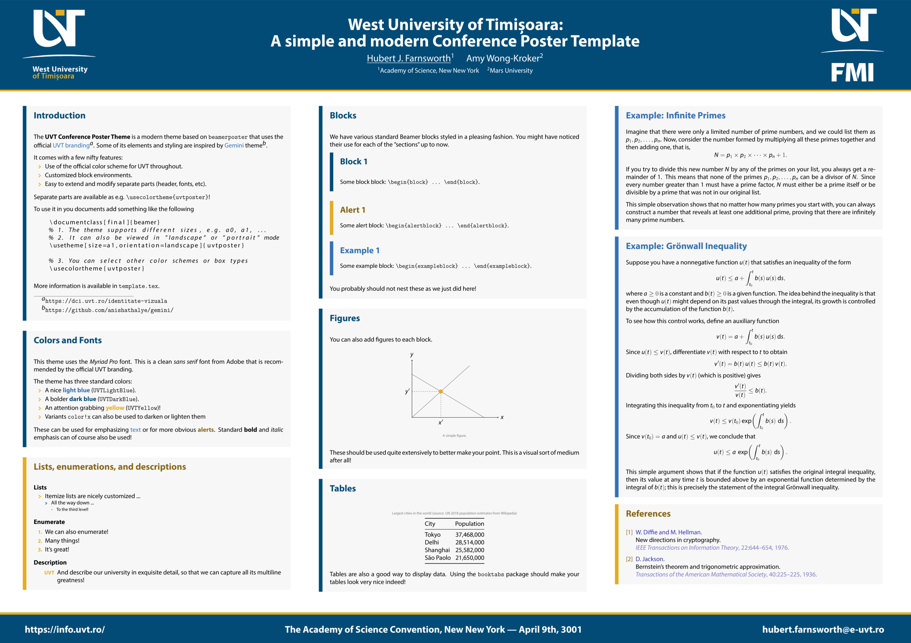

# UVT Conference Poster Template

This is an unofficial conference poster template for UVT (West University of Timișoara).
It is loosely based on the official UVT [branding](https://dci.uvt.ro/identitate-vizuala).
However, the university does not offer an example of a conference poster, so this is
just inspired by the existing examples.

This template class is fairly complete and working well, but any feature requests
or bug reports to improve it are **very welcome**!

## How to use

Copy `beamer*.sty`, `template.tex`, and the relevant logos from `assets/`
to your working directory. Modify `template.tex` as appropriate and build with
`PDFLaTeX` (or `XeLaTeX` or `LuaLaTeX` for the adventurous).

The package defines the following options used as `\usetheme[opts]{uvtposter}`.

| Option                            | Description                           |
| :-                                | :-                                    |
| `nomyriadpro`                     | Do not load the *Myriad Pro* fonts (default loads if available) |
| `size=aN`                         | Set the paper size                    |
| `orientation=name`                | Set the orientation to "landscape" or "portrait" |
| Other                             | Other options are passed to `beamerposter` |

The standard branding colors are given below.

| Color                             | RGB
| :-                                | :-
| `UVTLightBlue`                    |  `(52, 113, 183)` |
| `UVTDarkBlue`                     |  `(3, 75, 119)`   |
| `UVTYellow`                       |  `(228, 172, 36)` |

## Fonts

Note that, by default this uses the [Myriad Pro](https://fonts.adobe.com/fonts/myriad)
font. This font is generally not available for free, but can be purchased from
Adobe or a [reseller](https://www.fontspring.com/fonts/adobe/myriad-pro). The
OTF fonts can be directly loaded by the `XeLaTeX` or `LuaLaTeX` engines. To
get it working on `PDFLaTeX`, use the [FontPro](https://github.com/sebschub/FontPro)
distribution. If you cannot obtain the font (or the installation does not work
for some reason), it can be disabled with the `nomyriadpro` option. In general,
we recommend using a free sans serif font instead, e.g `\usepackage{helvet}` for
the Helvetica look-alike Nimbus Sans L or `\usepackage{paratype}` for the PT Sans
fonts that resemble Myriad Pro better.

If you are using `XeLaTeX` or `LuaLaTeX`, there are many other nice fonts to
keep in mind that would work well. For example: Carlito (a Calibri clone),
Caladea (a Cambria clone), Montserrat (inspired by Gotham), Adobe Source Sans,
and many others. A nice font will always make your poster look nicer!

## What it looks like

[Full PDF](template.pdf)

## Acknowledgement

This theme is based on the [Gemini](https://github.com/anishathalye/gemini/)
theme, but mainly keeps the header and footer from it. If you need a more general
theme, Gemini is quite wonderful!

## License

Creative Commons Attribution 4.0 International
