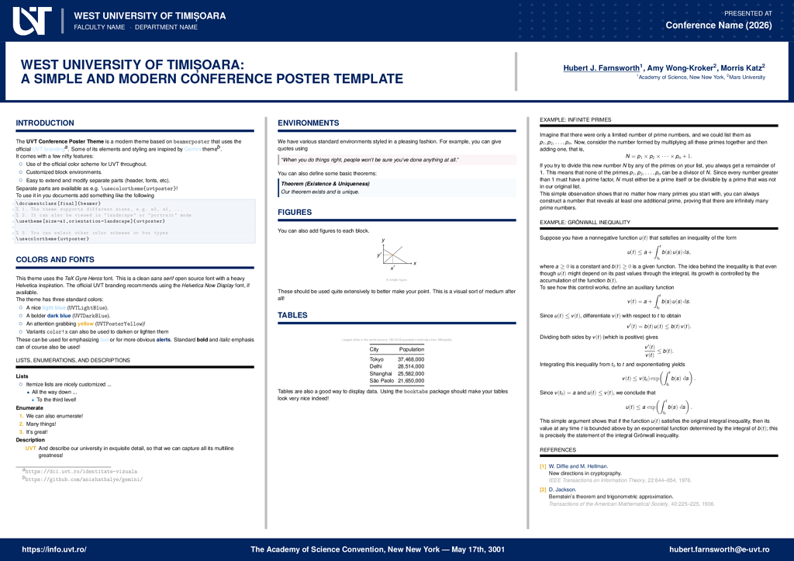

# UVT Conference Poster Template

[](https://github.com/alexfikl/uvt-poster/actions/workflows/ci.yml)
[](https://www.overleaf.com/docs?snip_uri=https://github.com/alexfikl/uvt-poster/archive/refs/heads/main.zip)

> [!NOTE]
> This template style is fairly complete and working well, but any feature requests
> or bug reports to improve it are **very welcome**! The theme should adjust to
> various aspect ratios and page sizes.

This is an unofficial conference poster template for UVT (West University of Timișoara).
It is loosely based on the official UVT [branding](https://dci.uvt.ro/identitate-vizuala).
However, the university does not offer an example of a conference poster, so this is
just inspired by the existing templates (for letterheads and presentation slides).

Templates in the same series:
* [UVT Letterhead Template](https://github.com/alexfikl/uvt-letterhead)
* [UVT Beamer Presentation Template](https://github.com/alexfikl/uvt-beamer)
* [UVT Conference Poster Template](https://github.com/alexfikl/uvt-poster)

## What it Looks Like



## How to Use It

Copy `beamerthemeuvtposter.sty`, `beamercolorthemeuvtposter.sty`, `template.tex`,
and the relevant logos from `assets/` to your working directory. Modify
`template.tex` as appropriate and build with `PDFLaTeX` (or `XeLaTeX` or `LuaLaTeX`
for the adventurous). The poster is based on the [beamerposter](https://github.com/deselaers/latex-beamerposter)
package and can be customized using standard Beamer macros (e.g. `\setbeamercolor`,
`\setbeamerfont`, and `\setbeamertemplate`).

The package defines the following options used as `\usetheme[opts]{uvtposter}`.

| Option                            | Description                           |
| :-                                | :-                                    |
| `language`                        | Can be `romanian` or `english`        |
| `helveticanow`                    | Attempt to load the the *Helvetica Now Display* fonts |
| `size=aN`                         | Set the paper size                    |
| `orientation=name`                | Set the orientation to "landscape" or "portrait" |
| `scale=1.0`                       | Scale the font sizes of the whole poster |
| `showframe`                       | [DEBUG] Shows a frame around page elements (margins, etc.) |
| `layoutgrid`                      | [DEBUG] Adds a debug grid to check alignment  |

Additional options are passed directly to `beamerposter`, so you should consult
its documentation. The `language` option is only used to automatically set some
default strings (e.g. for `\headeruniversity`) and other assets. If you provide
them yourself, this will have no effect.

The standard branding colors are given below.

| Color                             | RGB
| :-                                | :-
| `UVTDarkBlue`                     |  `(3, 58, 137)` |
| `UVTSkyBlue`                      |  `(37, 136, 231)` |
| `UVTLightBlue`                    |  `(174, 217, 248)` |
| `UVTBlack`                        |  `(18, 18, 18)` |
| `UVTAccentWhite`                  |  `(252, 245, 247)` |
| `UVTWhite`                        |  `(255, 255, 255)` |
| `UVTPosterYellow`                 |  `(228, 172, 36)` |
| `UVTPosterDarkBlue`               |  `(0, 37, 97)` |
| `UVTPosterDarkGray`               |  `(166, 166, 166)` |
| `UVTPosterLightGray`              |  `(191, 191, 191)` |

The following helper macros are defined for some standard functionality.

| Macro                             | Description                           |
| :-                                | :-                                    |
| `\footerleft`                     | Generic text to add on the left of the footer |
| `\footermiddle`                   | Generic text to add on the middle of the footer |
| `\footerright`                    | Generic text to add on the right of the footer |
| `\footerweb`                      | Personal or institutional website (on the left) |
| `\footerlocation`                 | Location of the poster presentation (in the middle) |
| `\footeremail`                    | Contact email (on the right)          |
| `\footername`                     | Presenter or institution name (on the right) |
| `\headerlogo`                     | Logo shown in the top left of the header |
| `\headeruniversity`               | Name of the university shown in the header (top left)|
| `\headerdepartment`               | Name of the faculty/department shown in the header (top left)|
| `\headerconference`               | Name of the conference shown in the header (top right)|
| `\heading`                        | A macro that adds a small heading inside blocks |
| `\separatorcolumn`                | Adds a standardized spacing between columns |

## Logos

The logo in the header is taken from the official university branding website.
It was trimmed and resized to better fit the header using
```bash
just trim logo.png
just square logo.png
```

The [UVT Letterhead Template](https://github.com/alexfikl/uvt-letterhead) has a
lot more logos in the right format, so you can get more from there. If you need
to add more logos to your poster, we recommend making a block at the bottom
right (under any references) and adding them there with appropriate acknowledgements.

## Fonts

Note that the Official Manual recommends the [Helvetica Display
Now](https://www.monotype.com/fonts/helvetica-now) font. This font is generally
not available for free, but can be purchased from Monotype or a
[reseller](https://www.myfonts.com/collections/helvetica-now-font-monotype-imaging).
Ideally, you can get it from the university for official documents. If you
managed to get it, you will need to use the `XeLaTeX` or `LuaLaTeX` engines to
load it (since `PDFLaTeX` does not support OTF or TTF fonts).

If you do not have the recommended font, a good alternative is the open source
`TeX Gyre Heros` font (a quality classic Helvetica clone). This is loaded by
default by the template if the `helveticanow` option is not given or if the
font is not found.

If you are using `XeLaTeX` or `LuaLaTeX`, there are many other nice fonts to
keep in mind that would work well. For example: Carlito (a Calibri clone),
Caladea (a Cambria clone), Montserrat (inspired by Gotham), Adobe Source Sans,
and many others. A nice font will always make your slides look nicer!

## Acknowledgement

This theme was originally based on the
[Gemini](https://github.com/anishathalye/gemini/) theme, but little of
it remains. If you need a more general theme, Gemini is quite wonderful!

## License

Creative Commons Attribution 4.0 International
